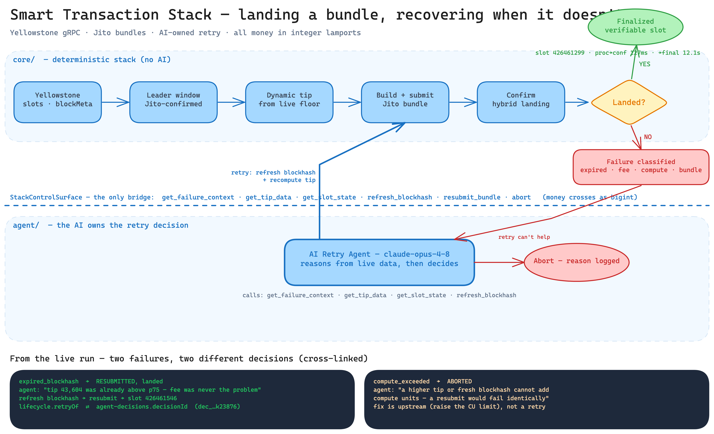

# smart-tx-stack

A Solana **smart transaction stack**: stream live slot/leader data over Yellowstone gRPC, submit Jito bundles into confirmed Jito leader windows with dynamically-priced tips, track every bundle through its full lifecycle (Submitted → Processed → Confirmed → Finalized) from the stream, classify failures, and let an **AI agent autonomously own the retry decision** — with its reasoning fully on the record.

Built for the Superteam Nigeria *Advanced Infrastructure Challenge*. Runs on **mainnet** (Jito has no devnet endpoints), so every landed slot is verifiable on a public explorer.

> **Architecture doc (separate, public):** _Notion link — see submission._
> **Live capture evidence:** [`docs/evidence/capture/`](./docs/evidence/capture/) — 11 real submissions, 9 landed, 2 induced failures, agent-driven recovery. Raw artifacts: [`lifecycle-log.jsonl`](./docs/evidence/capture/lifecycle-log.jsonl) · [`agent-decisions.jsonl`](./docs/evidence/capture/agent-decisions.jsonl).

---

## What it does

| Capability | Where |
|---|---|
| Live slot/leader monitoring via Yellowstone gRPC (reconnect + backpressure) | [`packages/core/src/stream/`](./packages/core/src/stream/) |
| Detect the correct leader window **+ confirm the leader runs Jito** (live `running_jito` validator set, not the ~95%-stake assumption) | [`packages/core/src/leader/`](./packages/core/src/leader/) |
| Construct & submit Jito bundles (`sendBundle`, base64, 1 rps) | [`packages/core/src/jito/`](./packages/core/src/jito/) |
| Dynamic tips from live tip-floor data — **no hardcoded values** | [`packages/core/src/tips/`](./packages/core/src/tips/) |
| Lifecycle tracking: Submitted/Processed/Confirmed/Finalized, timestamps, slots, latency deltas | [`packages/core/src/lifecycle/`](./packages/core/src/lifecycle/) |
| Detect & classify 4 failure classes (expired blockhash, fee too low, compute exceeded, bundle failure) | [`tracker.ts`](./packages/core/src/lifecycle/tracker.ts) |
| Landing confirmed via stream subscriptions (not RPC-poll-only) | [`tracker.ts`](./packages/core/src/lifecycle/tracker.ts) + [`bundle-confirmer.ts`](./packages/core/src/jito/bundle-confirmer.ts) |
| Automatic retries incl. blockhash refresh — **decided by the AI agent** | [`packages/agent/`](./packages/agent/) |
| Deterministic fault injection (stale blockhash, CU-starved) | [`packages/agent/src/capture/fault-injection.ts`](./packages/agent/src/capture/fault-injection.ts) |

**House rule, enforced everywhere:** all money is **integer lamports (`bigint`)**. SOL floats from external APIs are converted to lamports exactly once at the ingestion boundary ([`solToLamports`](./packages/core/src/money/lamports.ts)) and never re-enter arithmetic.

---

## Architecture



*A failed bundle isn't a dead end: it crosses one typed boundary to a reasoning agent that changes the right variable and loops back, or correctly refuses — every decision on the record. ([Excalidraw source](docs/diagrams/architecture.excalidraw).)*

Three layers, dependencies pointing one way — `capture → agent → core` — so the AI never touches web3.js, Jito, or the stream directly. That boundary is the bounty's *"clean separation between the AI layer and the core stack"*, and it's a single typed interface:

```
            ┌─────────────────────────────────────────────────────────┐
            │  agent/   AI retry agent (claude-opus-4-8)               │
            │  manual tool loop · visible reasoning → agent-decisions  │
            └───────────────▲─────────────────────────────────────────┘
                            │  StackControlSurface  (the ONLY bridge)
                            │  get_failure_context · get_tip_data ·
                            │  get_slot_state · refresh_blockhash ·
                            │  resubmit_bundle · abort_with_reason
            ┌───────────────┴─────────────────────────────────────────┐
            │  capture/  orchestrator — implements the surface against │
            │            the live stack; fault injection; campaign     │
            └───────────────▲─────────────────────────────────────────┘
                            │
   ┌────────────────────────┴────────────────────────────────────────┐
   │ core/                                                            │
   │  Yellowstone consumer ─▶ bounded queue ─▶ Lifecycle Tracker      │
   │   (slots+blockMeta, ping,    (backpressure)  (commitment buffer, │
   │    from_slot replay, dedupe)                  failure classifier,│
   │        │                                      JSONL log)         │
   │        ▼                                          ▲              │
   │  Leader-window detector + Jito-leader confirm     │              │
   │        │                                          │              │
   │        ▼                                   Bundle Confirmer      │
   │  Bundle builder ─▶ Jito client ─▶ sendBundle  (getBundleStatuses)│
   │        ▲                                                         │
   │  Dynamic tip engine ◀─ tip_floor REST + tip_stream WS           │
   └──────────────────────────────────────────────────────────────────┘
```

**Confirmation is hybrid.** Our stream provider (SolInfra Ace) does not surface our own wallet's transactions on Yellowstone (a genuine account-indexing limit on the tier — concurrency and token format were both ruled out). So landing detection uses Jito's purpose-built `getBundleStatuses` (300-slot lookback, reliable) for the **landing slot**, and the Yellowstone **slot stream** drives commitment progression (confirmed → finalized) and blockhash-expiry detection. The tracker exposes the same `onTransactionSeen` entry point a pure transaction-stream would call, so swapping to tx-stream confirmation is a one-line change if a provider streams our wallet. (`getInflightBundleStatuses` is treated as advisory only — we observed it report `Invalid` for bundles that in fact landed.)

Design rationale lives in the ADR (`decisions/adr-smart-tx-stack-*.md`): mainnet, TypeScript, raw-JSON-RPC Jito, single-tx bundles (tip in the same tx as the action — the uncle-bandit mitigation), integer lamports, AI Option 4 (autonomous retry), one concurrent gRPC connection.

---

## The AI agent (Option 4 — autonomous retry)

When a bundle fails, the agent — not a hardcoded policy — decides what to change and whether to retry at all. It runs a manual `@anthropic-ai/sdk` tool loop on **`claude-opus-4-8`** with adaptive thinking, and **every** thinking step, tool call, argument, and result is written to `agent-decisions.jsonl`. That trace is the *"reasoning is visible, not sequential automation"* evidence, and each resubmission is stamped with `agentDecisionId` so it cross-links back to the decision that produced it.

From the live capture run:

- **Expired blockhash** → the agent read the live tip floor, noted the failed tip (43,604 lamports) was *already above p75*, concluded **"fee was never the problem"**, refreshed the blockhash, and resubmitted into a confirmed Jito window — **landed** (slot `426461546`).
- **Compute exceeded** → the agent reasoned that *"neither a higher tip nor a fresh blockhash adds compute units, so any resubmission would fail identically"* and **aborted** rather than burn attempts on a futile retry — the fix is an upstream CU-limit change, which a retry can't make.

Two different failures, two correctly different decisions, both reasoned from real data.

---

## Live capture evidence

`pnpm --filter @smart-tx-stack/agent capture` ran the campaign on mainnet. Full table + traces in [`docs/evidence/capture/README.md`](./docs/evidence/capture/README.md).

| Gate check | Result |
|---|---|
| ≥10 real submissions | **11** |
| ≥2 failures | **2** (both deterministically induced) |
| ≥1 blockhash-expiry detected → reasoned → re-landed by the agent | **yes** (slot `426461546`) |
| every retry cross-links to an agent decision (0 fallback retries) | **yes** |
| landed bundles have explorer-verifiable slots | **9 landed** (`426461032`–`426461546`) |

---

## The three questions

### 1. What does the time delta between *processed* and *confirmed* tell you about network health?

It measures how long it takes a stake-weighted supermajority (≥⅔) to vote a slot to **optimistic confirmation** after the leader first produced it. It's a live, **fee-independent** gauge of consensus health *at submission time*.

In our run the median processed→confirmed delta was **≈127 ms** (739 slot samples; repeat probes saw 121–134 ms) — comfortably **under one 400 ms slot**, i.e. a healthy, low-latency cluster with no fork or vote-lag pressure. A *widening* delta is the warning sign: it means vote propagation is lagging, slots are being skipped/forked, or the cluster is congested — conditions under which a time-sensitive submission is more likely to miss its window regardless of how much you tip. (We compute this from the slot subscription's own receive timestamps, not from RPC polling.)

For contrast, the **confirmed→finalized** delta we measured was **≈12.1 s** median (11.8–13.2 s) — that's the structural ~32-slot rooting gap, *not* a health signal, which is exactly why the two deltas answer different questions.

### 2. Why should you never fetch a blockhash at the *finalized* commitment for a time-sensitive transaction?

A blockhash is only valid for **150 blocks (~60–90 s)**. A *finalized* blockhash is already **≥32 slots (~12 s — we measured 12.1 s)** behind the chain tip, so you spend ~20–25 % of the validity window before you've even signed, pushing you toward an expired-blockhash failure for no benefit.

And there's no upside to pay for: a `confirmed` block reverting would require a slashing-grade ≥⅓ equivocation, so optimistic confirmation is safe to build on. Fetch at **`confirmed`** — you get the full validity window and negligible rollback risk. Our stale-blockhash fault injection makes the failure concrete: holding a blockhash past its window got the bundle rejected with `-32602 bundle contains an expired blockhash`, and the agent's correct fix was to refresh (at `confirmed`) and resubmit.

### 3. What happens if the Jito leader skips its slot?

The bundle **doesn't land — and no tip is paid.** The tip is a transfer *inside* the atomic bundle, so it only executes if the bundle is included; a skipped slot costs you nothing but the missed opportunity. The bundle stays pending while the blockhash is valid and otherwise resolves Invalid/Failed; our stack detects the non-landing from the stream (no landing slot + block-height passing `lastValidBlockHeight`), never by trusting an inflight status.

Recovery is to **retarget the next *confirmed* Jito leader window** — we verify the upcoming leader against the live `running_jito` validator set (691 validators in our run) rather than assuming "~95 % of stake is Jito" — and resubmit with a recomputed tip. That's precisely the agent's retry loop. Depth nuance: an uncled/skipped slot can leak a bundle's transactions for independent rebroadcast, so bundles shouldn't assume absolute atomicity under uncles — which is also why we keep the tip in the *same* transaction as the action, so a rebroadcast still carries both.

---

## Quick start

```sh
pnpm install
cp .env.example .env        # then fill in your provider creds (see below)
pnpm typecheck && pnpm test # 88 unit tests

# generate a fresh burner wallet (gitignored under keys/), then fund it with a little SOL
node packages/core/scripts/generate-keypair.mjs keys/burner.json
```

`.env` (the single source of config; `.env.example` documents every key):

```sh
GRPC_ENDPOINT=fra.grpc.solinfra.dev:443   # any Yellowstone endpoint; bare host:port is fine
GRPC_X_TOKEN=...                          # provider token (omit for tokenless providers)
RPC_URL=https://...                       # unary RPC (leader schedule, blockhash, balance)
JITO_BLOCK_ENGINE_URL=https://mainnet.block-engine.jito.wtf
WALLET_KEYPAIR_PATH=./keys/burner.json
ANTHROPIC_API_KEY=sk-ant-...              # for the retry agent
```

Run things:

```sh
# zero-spend liveness probe: stream + RPC + Jito + tips + leader-window confirmation
pnpm --filter @smart-tx-stack/agent capture check

# full capture campaign (spends real SOL): N happy bundles + 2 induced failures,
# agent owns every retry. Writes logs/{lifecycle-log,agent-decisions}.jsonl
pnpm --filter @smart-tx-stack/agent capture 8

# the AI agent against a simulated surface (no SOL, real model)
pnpm --filter @smart-tx-stack/agent smoke

# core gates
pnpm --filter @smart-tx-stack/core soak          # 30-min stream soak + chaos reconnect
pnpm --filter @smart-tx-stack/core bundle-gate    # land one bundle end-to-end (hybrid confirm)
```

---

## Layout

```
packages/
  core/     # money utils, config, stream consumer, lifecycle tracker + failure classifier,
            # Jito client/builder/confirmer, leader-window + Jito-leader confirmation, tip engine
  agent/    # AI retry agent (tools, tool loop, decision log) behind StackControlSurface;
            # capture/ orchestrator (the live surface impl) + fault injection + capture bin
docs/
  evidence/capture/   # the judged lifecycle-log.jsonl + agent-decisions.jsonl + summary
  TritonOne/, yellowstone-grpc/, exampleclient.ts   # Yellowstone ground-truth references
```

## Stack

TypeScript (strict, `NodeNext`, `noUncheckedIndexedAccess`) · Node ≥22 · pnpm workspace · vitest · `@triton-one/yellowstone-grpc` · `@solana/web3.js` · raw JSON-RPC for Jito · `@anthropic-ai/sdk`.

## License

[MIT](./LICENSE)
